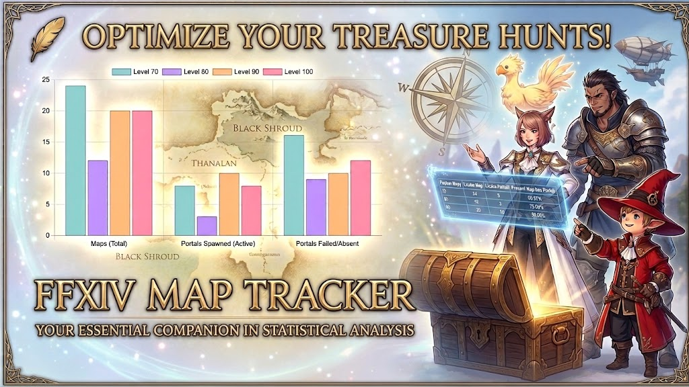

<p align="center">
  
</p>


**Current version:** `v0.4.0`

[🇵🇱 Polski](#-polski) · [🇬🇧 English](#-english) · [🇫🇷 Français](#-français)

---

## 🇵🇱 Polski

### O projekcie

**FFXIV Map Tracker** to fanowska aplikacja webowa stworzona z myślą o graczach **Final Fantasy XIV**, którzy chcą wygodnie śledzić swoje sesje Treasure Maps i analizować ich wyniki.

Wersja `v0.4.0` zapisuje każdą sesję osobno. Dzięki temu aplikacja może wyliczać statystyki dla konkretnych map i poziomów, analizować portal rate i dungeon clear rate, śledzić koszty zakupu map oraz pokazywać rzeczywisty zysk netto w Gil.

Aplikacja działa lokalnie w przeglądarce i nie wymaga konta ani zewnętrznej bazy danych.

### Najważniejsze funkcje

- **Tracker sesji** — zapisuj datę, mapę, liczbę ukończonych map, portale, dungeon clears, zarobiony Gil, koszt map i opcjonalną notatkę.
- **Historia sesji** — edytuj lub usuwaj pojedyncze wpisy bez resetowania całej bazy.
- **Statystyki** — analizuj wyniki według map, poziomów i wybranego okresu.
- **Portal rate** — liczony wyłącznie dla map, które faktycznie mogą otworzyć portal.
- **Dungeon clear rate** — liczony na podstawie otwartych portali.
- **Finanse** — porównuj `Gil earned`, `Gil spent`, `Net profit` oraz średni zysk na mapę.
- **Wykresy** — mapy i portale według poziomu, Gil w czasie, zysk według mapy oraz portal rate według mapy.
- **Guide / How to Use** — wbudowana instrukcja korzystania z aplikacji i backupów.
- **About App** — informacje o projekcie, prywatności danych i sposobie działania.
- **Responsywny interfejs** — desktop, tablet i urządzenia mobilne.
- **PWA** — aplikacja może działać jak instalowalna aplikacja webowa.
- **Migracja danych V3 → V4** — stare sumy są zachowywane jako wpisy legacy.

### Eksport i backup

FFXIV Map Tracker obsługuje kilka formatów, ponieważ każdy z nich ma inne zastosowanie:

| Format | Zastosowanie |
| --- | --- |
| **XLSX** | Pełny raport do Microsoft Excel i LibreOffice z wieloma arkuszami oraz wykresami na Dashboardzie |
| **ODS** | Skoroszyt przygotowany z myślą o LibreOffice Calc |
| **CSV** | Surowe dane sesji do dalszej analizy |
| **JSON** | Pełny backup danych użytkownika, który można ponownie zaimportować |
| **ZIP** | Pakiet zawierający XLSX, ODS, CSV i JSON |

Raport XLSX zawiera arkusze:

`Dashboard` · `Sessions` · `Maps` · `Levels` · `Finances` · `Map Database` · `Info`

Więcej informacji: [docs/EXPORTS.md](docs/EXPORTS.md)

### Jak korzystać

1. Wybierz Treasure Map.
2. Podaj datę i wynik sesji.
3. Wpisz liczbę map, portali i dungeon clears.
4. Dodaj zarobiony Gil oraz łączny koszt zakupionych map.
5. Zapisz sesję.
6. Otwórz **Statistics**, aby przeanalizować wyniki.
7. Regularnie pobieraj **backup JSON** lub **pakiet danych ZIP**.

### Przechowywanie danych

Dane są przechowywane lokalnie w przeglądarce za pomocą `localStorage`.

Oznacza to, że:

- aplikacja nie wymaga konta,
- kod aplikacji jest hostowany przez GitHub Pages, a dane użytkownika pozostają w localStorage przeglądarki,
- wyczyszczenie danych przeglądarki może usunąć zapisane sesje,
- aktualizacja kodu na tym samym GitHub Pages nie wymaga kopiowania aplikacji ani ponownego importu danych,
- przed zmianą urządzenia lub czyszczeniem danych witryny warto wykonać backup JSON.

### Uruchamianie lokalnie

Najwygodniej podczas pracy nad projektem używać **VS Code + Live Server**:

1. Otwórz katalog projektu w VS Code.
2. Kliknij prawym przyciskiem `index.html`.
3. Wybierz **Open with Live Server**.
4. Otwórz adres pokazany przez rozszerzenie, np. `http://127.0.0.1:5500/`.

Możesz też użyć dowolnego innego lokalnego serwera HTTP. Python nie jest częścią projektu — polecenie `python -m http.server` jest jedynie opcjonalnym sposobem uruchomienia prostego serwera lokalnego.

Nie zaleca się uruchamiania aplikacji bezpośrednio przez `file://`, ponieważ projekt korzysta z modułów JavaScript oraz service workera.

### Struktura projektu

```text
FF-XIV-Map-Tracker/
├── assets/
│   └── icons/
│       ├── icon-192.png
│       └── icon-512.png
├── docs/
│   ├── CHANGELOG.md
│   ├── CODE-STYLE.md
│   ├── DATA-MODEL.md
│   ├── DEVELOPMENT.md
│   └── EXPORTS.md
├── js/
│   ├── export/
│   │   ├── bundleExport.js
│   │   ├── csvExport.js
│   │   ├── download.js
│   │   ├── excelExport.js
│   │   ├── jsonExport.js
│   │   └── odsExport.js
│   ├── statistics/
│   │   └── charts.js
│   ├── app.js
│   ├── calculations.js
│   ├── i18n.js
│   ├── mapsData.js
│   └── storage.js
├── index.html
├── manifest.json
├── styles.css
├── sw.js
└── README.md
```

### Dokumentacja

- [Changelog](docs/CHANGELOG.md)
- [Styl i czytelność kodu](docs/CODE-STYLE.md)
- [Model danych V4](docs/DATA-MODEL.md)
- [Development / struktura projektu](docs/DEVELOPMENT.md)
- [Eksporty i backupy](docs/EXPORTS.md)

### Technologie

Projekt pozostaje lekką aplikacją webową bez frameworka:

- HTML5
- CSS3
- Vanilla JavaScript / ES Modules
- Chart.js
- ExcelJS
- SheetJS
- JSZip
- Web App Manifest
- Service Worker
- localStorage

### Informacje prawne

**FINAL FANTASY XIV** oraz powiązane nazwy, znaki towarowe i zasoby należą do **Square Enix Holdings Co., Ltd.**

FFXIV Map Tracker jest niezależnym, fanowskim projektem i nie jest powiązany ze Square Enix ani przez nią wspierany.

Projekt został stworzony przez **RemiTech** dla społeczności Final Fantasy XIV. Aplikacja jest udostępniana do bezpłatnego użytku społecznościowego. Komercyjna redystrybucja oraz przypisywanie sobie autorstwa projektu lub kodu nie są dozwolone.

> Jeśli projekt ma być udostępniany jako open source na określonych warunkach, warto dodać osobny plik `LICENSE`, który formalnie opisze zasady korzystania z kodu.

---

<details>
<summary><strong>🇬🇧 English</strong></summary>

### About

**FFXIV Map Tracker** is a fan-made web application for **Final Fantasy XIV** players who want to record Treasure Map sessions and analyze their results.

Version `v0.4.0` uses a session-based data model. Each run is stored separately, allowing the app to calculate statistics per map and level, analyze portal and dungeon clear rates, track map purchase costs, and show actual net Gil profit.

The app is local-first and does not require an account or a dedicated server-side database.

### Key features

- **Session tracker** — record date, map, completed maps, portals, dungeon clears, earned Gil, map purchase cost, and an optional note.
- **Session history** — edit or delete individual entries.
- **Statistics dashboard** — analyze results by map, level, and time period.
- **Portal rate** — calculated only from maps that are actually portal eligible.
- **Dungeon clear rate** — calculated from opened portals.
- **Finances** — compare Gil earned, Gil spent, net profit, and average profit per map.
- **Charts** — maps and portals by level, Gil over time, profit by map, and portal rate by map.
- **Guide / How to Use** — built-in usage and backup instructions.
- **About App** — project, privacy, and data storage information.
- **Responsive UI** — desktop, tablet, and mobile layouts.
- **PWA support** — installable web app behavior where supported.
- **V3 → V4 migration** — older aggregate totals are preserved as legacy sessions.

### Export & backup

| Format | Purpose |
| --- | --- |
| **XLSX** | Multi-sheet report for Microsoft Excel and LibreOffice, including Dashboard chart images |
| **ODS** | Workbook intended for LibreOffice Calc |
| **CSV** | Raw session data for further analysis |
| **JSON** | Complete restorable user-data backup |
| **ZIP** | Bundle containing XLSX, ODS, CSV, and JSON |

The XLSX report contains:

`Dashboard` · `Sessions` · `Maps` · `Levels` · `Finances` · `Map Database` · `Info`

See [docs/EXPORTS.md](docs/EXPORTS.md) for details.

### Quick start

1. Select a Treasure Map.
2. Enter the session date and results.
3. Record maps, portals, and dungeon clears.
4. Enter earned Gil and the total cost of purchased maps.
5. Save the session.
6. Open **Statistics** to analyze the data.
7. Regularly download a **JSON backup** or a **data ZIP package**.

### Local data

Application data is stored in the browser using `localStorage`.

GitHub Pages hosts the application code, while tracker data remains in browser `localStorage`. Updating the app on the same GitHub Pages site does not require copying the application or re-importing data. Export JSON before clearing site data or moving to another device.

### Local development

The easiest development workflow is **VS Code + Live Server**:

1. Open the project directory in VS Code.
2. Right-click `index.html`.
3. Select **Open with Live Server**.
4. Open the address provided by the extension.

Any local HTTP server can be used. Python is not a project dependency; `python -m http.server` is only an optional way to serve the files locally.

Opening the app directly through `file://` is not recommended because the project uses JavaScript modules and a service worker.

### Documentation

- [Changelog](docs/CHANGELOG.md)
- [Code style](docs/CODE-STYLE.md)
- [V4 data model](docs/DATA-MODEL.md)
- [Development guide](docs/DEVELOPMENT.md)
- [Exports and backups](docs/EXPORTS.md)

### Technology

HTML5 · CSS3 · Vanilla JavaScript / ES Modules · Chart.js · ExcelJS · SheetJS · JSZip · Web App Manifest · Service Worker · localStorage

### Legal notice

**FINAL FANTASY XIV** and related names, trademarks, and assets are the property of **Square Enix Holdings Co., Ltd.**

FFXIV Map Tracker is an independent fan-made project and is not affiliated with or endorsed by Square Enix.

The project was created by **RemiTech** for the Final Fantasy XIV community. It is provided for free community use. Commercial redistribution and claiming authorship of the project or its code are not permitted.

</details>

---

<details>
<summary><strong>🇫🇷 Français</strong></summary>

### À propos

**FFXIV Map Tracker** est une application web créée par un fan pour les joueurs de **Final Fantasy XIV** qui souhaitent enregistrer leurs sessions de cartes aux trésors et analyser leurs résultats.

La version `v0.4.0` utilise un modèle de données basé sur les sessions. Chaque session est enregistrée séparément, ce qui permet de calculer des statistiques par carte et par niveau, d'analyser les taux de portails et de réussite des donjons, de suivre le coût d'achat des cartes et d'afficher le bénéfice net réel en Gils.

L'application fonctionne localement dans le navigateur et ne nécessite ni compte ni base de données serveur dédiée.

### Fonctionnalités principales

- **Suivi des sessions** — date, carte, cartes terminées, portails, donjons terminés, Gils gagnés, coût des cartes et note facultative.
- **Historique** — modification et suppression de sessions individuelles.
- **Tableau de statistiques** — analyse par carte, niveau et période.
- **Taux de portail** — calculé uniquement pour les cartes réellement éligibles à un portail.
- **Taux de réussite des donjons** — calculé à partir des portails ouverts.
- **Finances** — Gils gagnés, Gils dépensés, bénéfice net et bénéfice moyen par carte.
- **Graphiques** — cartes et portails par niveau, Gils dans le temps, bénéfice par carte et taux de portail par carte.
- **Guide / How to Use** — aide intégrée pour l'utilisation et les sauvegardes.
- **About App** — informations sur le projet et le stockage local.
- **Interface responsive** — ordinateur, tablette et mobile.
- **PWA** — comportement d'application web installable lorsque le navigateur le permet.
- **Migration V3 → V4** — conservation des anciennes données agrégées sous forme de sessions legacy.

### Exportation et sauvegarde

| Format | Utilisation |
| --- | --- |
| **XLSX** | Rapport multi-feuilles pour Microsoft Excel et LibreOffice avec graphiques sur le Dashboard |
| **ODS** | Classeur destiné à LibreOffice Calc |
| **CSV** | Données brutes des sessions |
| **JSON** | Sauvegarde complète pouvant être restaurée |
| **ZIP** | Archive contenant XLSX, ODS, CSV et JSON |

Le rapport XLSX contient :

`Dashboard` · `Sessions` · `Maps` · `Levels` · `Finances` · `Map Database` · `Info`

Plus de détails : [docs/EXPORTS.md](docs/EXPORTS.md)

### Utilisation rapide

1. Sélectionnez une Treasure Map.
2. Saisissez la date et les résultats de la session.
3. Indiquez le nombre de cartes, de portails et de donjons terminés.
4. Saisissez les Gils gagnés et le coût total des cartes achetées.
5. Enregistrez la session.
6. Ouvrez **Statistics** pour analyser les données.
7. Téléchargez régulièrement une **sauvegarde JSON** ou un **paquet ZIP de données**.

### Stockage local

Les données sont enregistrées dans le navigateur avec `localStorage`.

GitHub Pages héberge le code de l’application, tandis que les données du tracker restent dans le `localStorage` du navigateur. Une mise à jour sur le même site GitHub Pages ne nécessite pas de recopier l’application ni de réimporter les données. Exportez JSON avant d’effacer les données du site ou de changer d’appareil.

### Développement local

La méthode la plus simple est **VS Code + Live Server**. N'importe quel serveur HTTP local convient également.

Python n'est pas une dépendance du projet. La commande `python -m http.server` est seulement une méthode facultative pour servir les fichiers localement.

L'ouverture directe via `file://` n'est pas recommandée, car l'application utilise des modules JavaScript et un service worker.

### Documentation

- [Changelog](docs/CHANGELOG.md)
- [Style du code](docs/CODE-STYLE.md)
- [Modèle de données V4](docs/DATA-MODEL.md)
- [Guide de développement](docs/DEVELOPMENT.md)
- [Exports et sauvegardes](docs/EXPORTS.md)

### Technologies

HTML5 · CSS3 · Vanilla JavaScript / ES Modules · Chart.js · ExcelJS · SheetJS · JSZip · Web App Manifest · Service Worker · localStorage

### Mentions légales

**FINAL FANTASY XIV** ainsi que les noms, marques et ressources associés appartiennent à **Square Enix Holdings Co., Ltd.**

FFXIV Map Tracker est un projet indépendant créé par un fan et n'est ni affilié à Square Enix ni approuvé par cette société.

Le projet a été créé par **RemiTech** pour la communauté Final Fantasy XIV. Il est mis gratuitement à disposition de la communauté. La redistribution commerciale et l'appropriation de la paternité du projet ou du code ne sont pas autorisées.

</details>

---

## Project status

`v0.4.0` — session-based tracker, statistics dashboard, Guide, About, financial tracking, XLSX/ODS/CSV/JSON exports, backup restore, responsive UI, and PWA support.

For implementation details, see the [`docs/`](docs/) directory.
